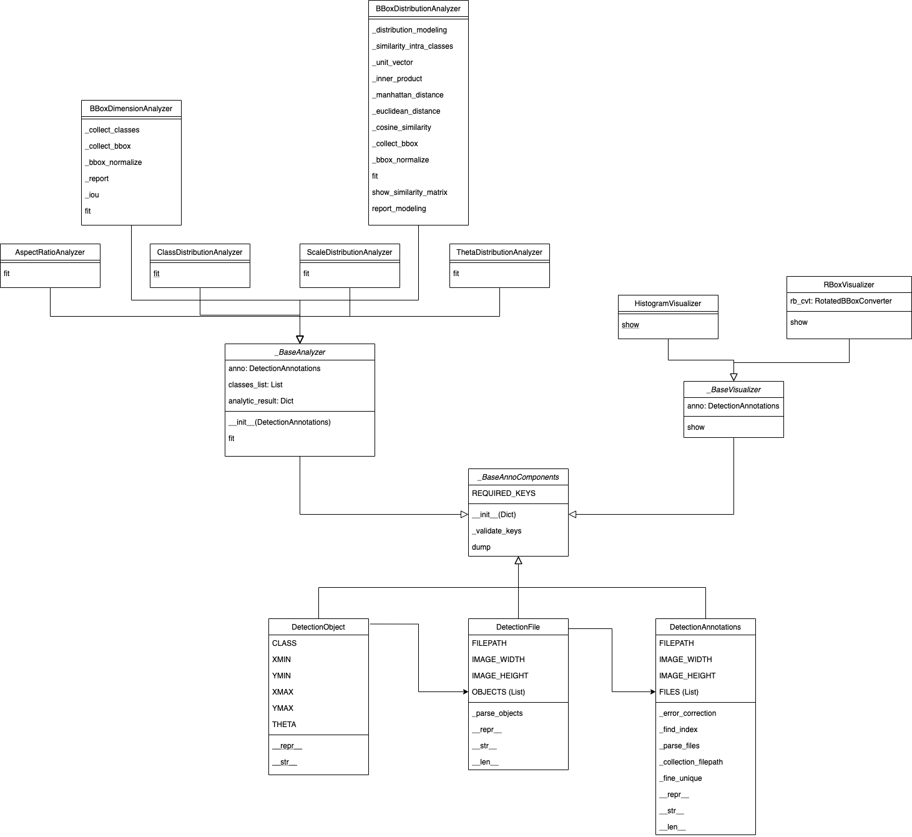
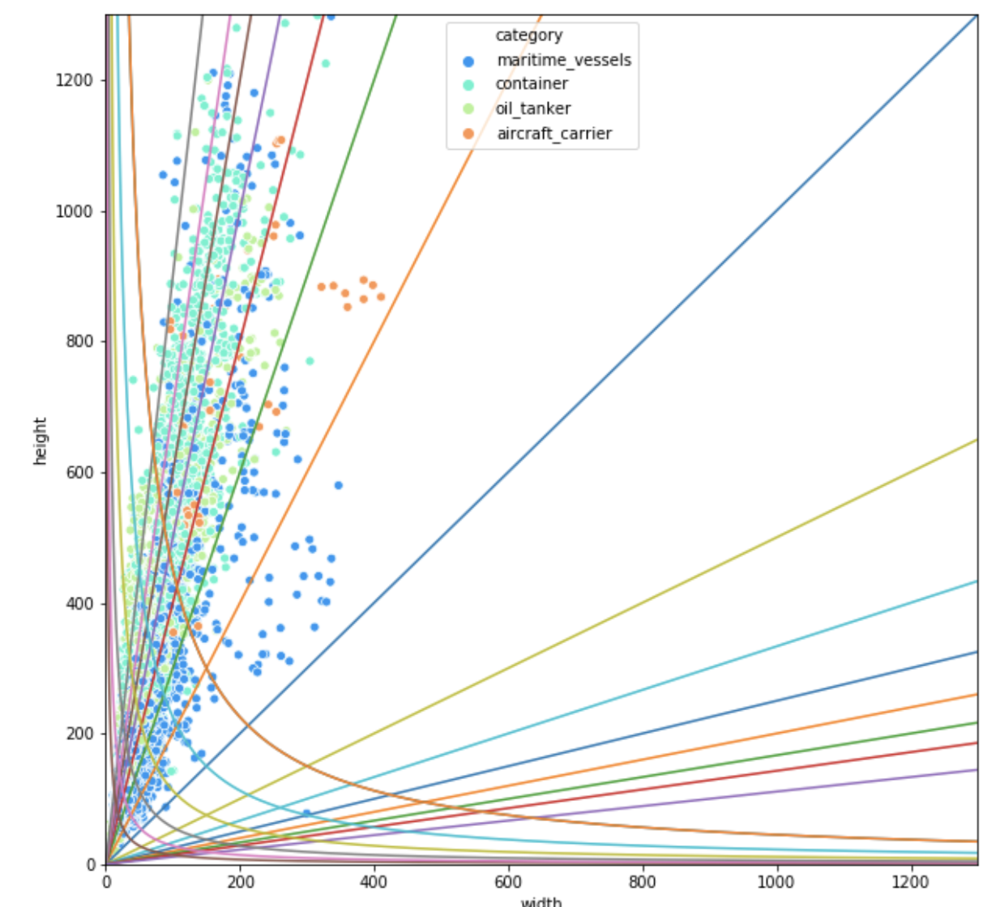
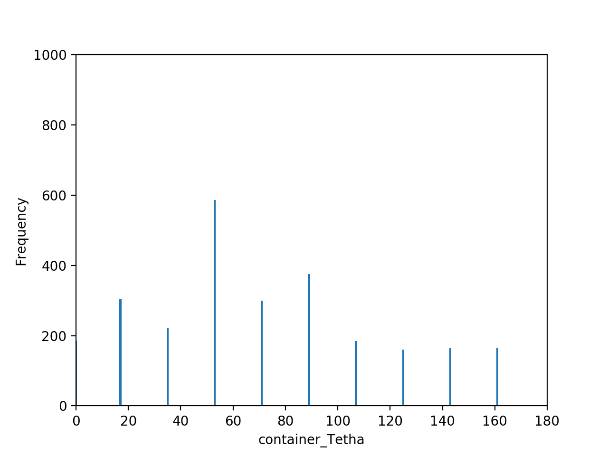
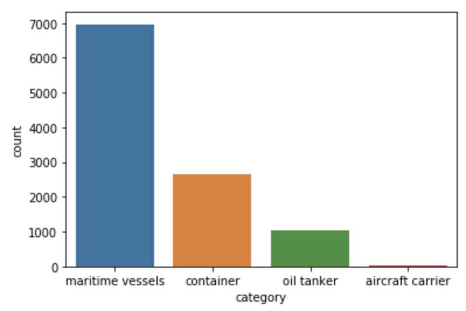

# 다중 스케일 위성 영상을 활용한 Faster R-CNN기반 선박 검출 알고리즘


## 요약

데이콘에서 진행한 [[국방] 위성 이미지 객체 검출 대회](https://dacon.io/competitions/official/235492/overview/)에서 mAP 0.745로 최종순위 5위를 기록한 펭수high팀의 접근방법을 소개한다. 대회에서 제공된 위성영상 데이터셋은 3000x3000 해상도의 큰 이미지 크기를 갖으며, 클래스간 불균형,객체 크기 분산이 큰 특징을 갖는다. 본 팀은 클래스간 불균형, 객체 크기의 분산이 큰 문제를 해결하기 위해서 제공된 위성영상 데이터셋을 다중 스케일로 분할하으며 detectron2 프레임워크의 Faster R-CNN을 이용하여 학습하였다. 또한 클래스간 불균형 문제를 해결하기 위해서 극단적으로 클래스 수가 적은 "항공모함" 클래스를 별도의 모델로 분할하여 학습하여 mAP 0.745라는 최종성적을 거두었다. 본 팀이 제안한 알고리즘은 테스트 데이터셋의 Public Score와 Private Score간 mAP 차이가 0.0231으로 다른 상위 6개팀의 mAP 차이인 0.03~0.07보다 눈에 띌 정도로 적어 일반화 성능이 뛰어난 것을 확인하였다.


## 서론

딥러닝 기반의 객체검출 알고리즘은 크게 1-Stage, 2-Stage 알고리즘으로 구분된다. 1-Stage 객체 검출 알고리즘은 OverFeat으로 시작하여 YOLO, YOLO9000, YOLOv3 등으로 이어지며 객체 여부와 박스의 크기를 예측하는 Proposal Network와 박스 내부의 클래스를 분류하는 분류 네트워크가 통합된 구조를 갖기 때문에 2-Stage모델보다 성능은 떨어지나 빠른 추론속도가 장점이다. 2-Stage 객체 검출 알고리즘은 R-CNN으로 시작하여 Fast R-CNN, Faster R-CNN, Mask R-CNN으로 1-Stage 모델과 비교했을 때, Proposal Network와 박스 내부의 클래스를 분류하는 분류 네크워크가 분리되어있는 복잡한 구조로 인해 느린 연산속도가 단점이지만 높은 성능이 장점이다.

공공 객체 탐지 데이터셋으로 알려진 COCO, PASCAL VOC 데이터셋은 클래스 불균형 문제를 항상 내포하고있으며, 객체 탐지를 위한 이미지 영역은 대부분 Background로 채워져있다는 추가적인 불균형 문제도 있다. 이로 인해 특정 클래스의 성능이 떨어지며 이를 막기위해 RetinaNet은 Background class와 같이 클래스 수가 많아 손실 함수에 빠르게 수렴되어 작은 손실값을 갖는 예를 easy example, 클래스 수가 적어 큰 손실값을 갖는 예를 hard example로 정의하여 손실함수의 비중을 다르게 하는 방법을 제안하였다. MegDet은 분류 모델과 다르게 큰 이미지 해상도로 인해 객체탐지 모델의 학습 배치가 적은 것이 객체탐지 모델에서 사용하는 BatchNorm 통계값에 악영향을 미쳐 성능하락이 발생한다는 점을 지적하며 128개의 GPU를 사용하여 학습 배치를 크게 적용하는 방법을 제안하였다.

딥러닝 기반의 객체검출 알고리즘은 모두 다중 스케일에서의 강건성이 약한 것으로 알려져있으며 특히 작은 객체 탐지율이 떨어지는 것으로 알려져있다. 이는 컨볼루션 네트워크와 풀링레이어에서 특징맵의 해상도 소실로 인해 작은 객체의 특징이 소실되는 것이 주 원인으로 알려져있으며 이를 보완하기 위해서 뉴럴네트워크의 중간 레이어의 다양한 크기의 특징맵에서 객체탐지 후에 이를 합치는 FPN, 재귀적으로 특징맵을 합치는 RRC(recurrent rolling convolution), 다양한 크기의 특징맵을 병합할 때 가중치를 주는 BiFPN을 제안한 EfficientDet이 있다.

SNIP과 SNIPER는 전이 학습을 위한 학습데이터로 사용되는 ImageNet데이터와 객체 탐지 데이터셋의 스케일 분포가 서로 상이한 것을 지적하며 객체 탐지 모델을 학습할 때, 스케일 분포를 일관성있게 만들어 학습하는 방법을 제안했다. AutoFocus는 SNIPER가 다중 스케일 추론을하여 추론시간이 증가하는 단점을 보완하기 위해 Focus Chip Generation이라는 별도의 브랜치 네트워크 구성을 제안하였다.

SCRDet은 작은 객체를 잘 탐지하기 위해서 장애가되는 "불충분한 객체 특징 정보"와 "부적절한 앵커 샘플링"을 해소하기 위해 최대로 객체 박스와 중첩될 수 있는 EMO 점수를 예측할 수 있으면서 FPN에서 나오는 특징맵을 잘 혼합할 수 있는 SF-Net을 제안하였으며 다중 스케일에서 학습할 수 있는 어텐션 네트워크인 MDA-Net을 제안하였다.

본 팀은 4개월이라는 짧은 기간 동안 최고의 성능을 달성하기 위해서 앞서 설명한 관련 논문들에 착안하여 1). "Box Scale, Rotation Angle, Aspect Ratio를 분석을 통한  앵커 최적화", 2) "다중스케일에서 객체 검출 모델 학습", 3). "클래스 불균형 문제를 해소하기 위한 모델 분리"로 접근하였으며 최종적으로 mAP 0.745라는 최종성적을 거두었다. 본 팀이 제안한 알고리즘은 테스트 데이터셋의 Public Score와 Private Score간 mAP 차이가 0.0231으로 다른 상위 6개팀의 mAP 차이인 0.03~0.07보다 눈에 띌 정도로 적어 일반화 성능이 뛰어나다는 것을 확인하였다.


## 방법론

### 데이터 분석

Box Scale, Rotation Angle, Aspect Ratio 분석을 통해 앵커 최적화 작업 및 학습을 위한 데이터셋을 만들기 위해서 위성 영상 데이터셋의 레이블을 분석하는 작업을 진행하였다.

레이블은 `*.json`으로 구성되어있으며 내부 구조는 아래와 같다.

```
{
    "features": [
        {
            "geometry": {
                "coordinates": [
                    [
                        [
                            -72.094811,
                            41.347997,
                            0.0
                        ],
                        [
                            -72.094705,
                            41.34803,
                            0.0
                        ],
                        [
                            -72.094611,
                            41.347726,
                            0.0
                        ],
                        [
                            -72.094717,
                            41.347693,
                            0.0
                        ]
                    ]
                ],
                "type": "Polygon"
            },
            "properties": {
                "bounds_imcoords": "2901.645703982593,41.22133429754296,2931.0626201838254,32.159790660903546,2957.0596982980583,116.55533065158266,2927.642782096826,125.61687428822208",
                "edited_by": "Ilwon Lee @ SI Analytics",
                "feature_id": [
                    "3cd627bc8bb5856948f4a00622666c7d12317af10765408b3b7bc51cfcfe912b"
                ],
                "image_id": "0.png",
                "ingest_time": "2019:01:14 20:40:13",
                "type_id": 4,
                "type_name": "maritime vessels"
            },
            "type": "Feature"
        },
        ...
    ]
}
```

- `geometry` : 해당 영상의 위경도 좌표
- `properties` : 객체 정보
  - `bounds_imcoords`: 객체 박스의 4개 꼭지점(point1~4)
  - `image_id`: 이미지 파일 이름
  - `type_id`: 클래스 인덱스 정보
  - `type_name`: 클래스 이름


**각도 정보 추출**

주어진 레이블을 이용하여 데이터셋을 학습시키기 위해서는 어떤 모델 컨셉을 사용하냐에 따라 접근법이 크게 틀려질 수 있다. 만약 keypoint detection 방식의 접근방법을 사용한다면 레이블에 명시되어있는 `bounds_imcoords`를 사용해도 되었으나 본 팀은 일반적인 rotated box detector를 학습시키는것이 목적이었기 때문에 이를 `[cx, cy, width, height, angle or theta]`로 데이터 변환작업을 진행했다. 

레이블에는 객체의 명확한 회전정보를 주지 않았기 때문에 points 정보를 활용하여 회전정보를 추출해야했다. 분석 결과 객체의 point 정보는 Clock wise로 구성되어있었다. 몇몇 데이터는 Count Clock wise로 구성되어있는 경우도 있어 Count Clock wise로 구성된 데이터는 Clock wise로 변환한 다음에 수평선의 벡터(0, 1)과 (point4, point1)벡터의  각도를 통해서 theta값을 추출했다.


- 그림 넣기


**공통 인터페이스 기반의 분석 도구**

추출된 각도정보를 통해서 `[cx, cy, width, height, theta]`정보를 획득할 수 있었으며, 이를 기반으로 공통 어노테이션 인터페이스를 구현하였다. 해당 인터페이스를 통해 `데이터 로더`, `시각화 도구`, `분석 도구`가 접근하여 활용할 수 있게 설계되었다.

설계에 대한 클래스 다이어그램은 아래와 같다.




**Rotation Angle, Aspect Ratio, Scale, Class 분포**

구현된 분석도구를 통해 Rotation Angle, Aspect Ratio, Scale, Class 분포를 확인하였다.

쌍곡선은 Aspect Ratio를 의미하여 직선은 Scale의 분포를 의미한다. 이를 활용하여 각 클래스별, 통합 Aspect Ratio와 Scale값을 추출하였다. 이렇게 추출된 값은 추후 모델의 configuration에 적용하여 모델을 학습하고 추론하는데 활용하였다.




회전 정보는 theta값을 angle값으로 변환하여 확인하였으며 0~180도까지 상대적으로 균일하게 분포한 것을 확인하여 별도의 최적화 작업을 진행하지 않았다.




클래스 분포를 확인한 결과 maritime vessels, container, oil tanker, aircraft carrier 순으로 불균형을 확인할 수 있었다. 압도적으로 적은 aircraft carrier로 인하여 통합 모델에서는 학습이 안될 것을 우려하였고 추후 상대적으로 aircraft carrier가 매우 낮은 confidence값을 갖는다는 것이 확인되어 별도 모델로 분리하게 되었다.

또한 해당 분석은 최종적으로 제출될 submit file을 정렬할 때, 클래스 불균형 문제로 container, oil tanker, aircraft 순으로 정렬하고 마지막에 maritime vessels를 정렬하는 전략에 영향을 주었다.





### 데이터 전처리(스나이퍼)

- ??

### 데이터 어그멘테이션

- 류원탁 작성

### 모델

- ??

### 학습

- ??

### 실험

- Martin 작성

## 결론

- ??

## Ablation Study

- ??

## Reference

- ??