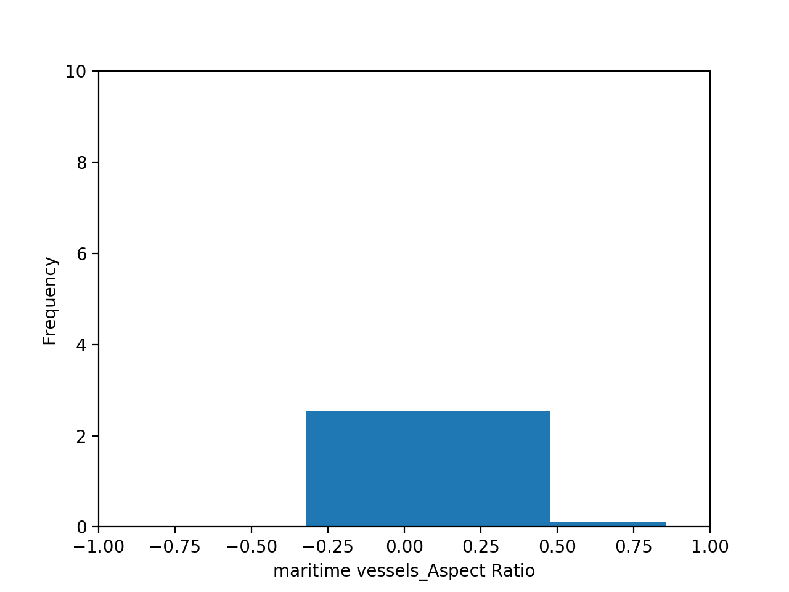

# 다중 스케일 위성 영상을 활용한 Faster R-CNN기반 선박 검출 알고리즘


## 요약

데이콘에서 진행한 [[국방] 위성 이미지 객체 검출 대회](https://dacon.io/competitions/official/235492/overview/)에서 mAP 0.745로 최종순위 5위를 기록한 펭수high팀의 접근방법을 소개한다. 대회에서 제공된 위성영상 데이터셋은 3000x3000 해상도의 큰 이미지 크기를 갖으며, 클래스간 불균형,객체 크기 분산이 큰 특징을 갖는다. 본 팀은 클래스간 불균형, 객체 크기의 분산이 큰 문제를 해결하기 위해서 제공된 위성영상 데이터셋을 다중 스케일로 분할하으며 detectron2 프레임워크의 Faster R-CNN을 이용하여 학습하였다. 또한 클래스간 불균형 문제를 해결하기 위해서 극단적으로 클래스 수가 적은 "항공모함" 클래스를 별도의 모델로 분할하여 학습하여 mAP 0.745라는 최종성적을 거두었다. 본 팀이 제안한 알고리즘은 테스트 데이터셋의 Public Score와 Private Score간 mAP 차이가 0.0231으로 다른 상위 6개팀의 mAP 차이인 0.03~0.07보다 눈에 띌 정도로 적어 일반화 성능이 뛰어난 것을 확인하였다.


## 서론

딥러닝 기반의 객체검출 알고리즘은 크게 1-Stage, 2-Stage 알고리즘으로 구분된다. 1-Stage 객체 검출 알고리즘은 OverFeat으로 시작하여 YOLO, YOLO9000, YOLOv3 등으로 이어지며 객체 여부와 박스의 크기를 예측하는 Proposal Network와 박스 내부의 클래스를 분류하는 분류 네트워크가 통합된 구조를 갖기 때문에 2-Stage모델보다 성능은 떨어지나 빠른 추론속도가 장점이다. 2-Stage 객체 검출 알고리즘은 R-CNN으로 시작하여 Fast R-CNN, Faster R-CNN, Mask R-CNN으로 1-Stage 모델과 비교했을 때, Proposal Network와 박스 내부의 클래스를 분류하는 분류 네크워크가 분리되어있는 복잡한 구조로 인해 느린 연산속도가 단점이지만 높은 성능이 장점이다.

공공 객체 탐지 데이터셋으로 알려진 COCO, PASCAL VOC 데이터셋은 클래스 불균형 문제를 항상 내포하고있으며, 객체 탐지를 위한 이미지 영역은 대부분 Background로 채워져있다는 추가적인 불균형 문제도 있다. 이로 인해 특정 클래스의 성능이 떨어지며 이를 막기위해 RetinaNet은 Background class와 같이 클래스 수가 많아 손실 함수에 빠르게 수렴되어 작은 손실값을 갖는 예를 easy example, 클래스 수가 적어 큰 손실값을 갖는 예를 hard example로 정의하여 손실함수의 비중을 다르게 하는 방법을 제안하였다. MegDet은 분류 모델과 다르게 큰 이미지 해상도로 인해 객체탐지 모델의 학습 배치가 적은 것이 객체탐지 모델에서 사용하는 BatchNorm 통계값에 악영향을 미쳐 성능하락이 발생한다는 점을 지적하며 128개의 GPU를 사용하여 학습 배치를 크게 적용하는 방법을 제안하였다.

딥러닝 기반의 객체검출 알고리즘은 모두 다중 스케일에서의 강건성이 약한 것으로 알려져있으며 특히 작은 객체 탐지율이 떨어지는 것으로 알려져있다. 이는 컨볼루션 네트워크와 풀링레이어에서 특징맵의 해상도 소실로 인해 작은 객체의 특징이 소실되는 것이 주 원인으로 알려져있으며 이를 보완하기 위해서 뉴럴네트워크의 중간 레이어의 다양한 크기의 특징맵에서 객체탐지 후에 이를 합치는 FPN, 재귀적으로 특징맵을 합치는 RRC(recurrent rolling convolution), 다양한 크기의 특징맵을 병합할 때 가중치를 주는 BiFPN을 제안한 EfficientDet이 있다.

SNIP과 SNIPER는 전이 학습을 위한 학습데이터로 사용되는 ImageNet데이터와 객체 탐지 데이터셋의 스케일 분포가 서로 상이한 것을 지적하며 객체 탐지 모델을 학습할 때, 스케일 분포를 일관성있게 만들어 학습하는 방법을 제안했다. AutoFocus는 SNIPER가 다중 스케일 추론을하여 추론시간이 증가하는 단점을 보완하기 위해 Focus Chip Generation이라는 별도의 브랜치 네트워크 구성을 제안하였다.

SCRDet은 작은 객체를 잘 탐지하기 위해서 장애가되는 "불충분한 객체 특징 정보"와 "부적절한 앵커 샘플링"을 해소하기 위해 최대로 객체 박스와 중첩될 수 있는 EMO 점수를 예측할 수 있으면서 FPN에서 나오는 특징맵을 잘 혼합할 수 있는 SF-Net을 제안하였으며 다중 스케일에서 학습할 수 있는 어텐션 네트워크인 MDA-Net을 제안하였다.

본 팀은 4개월이라는 짧은 기간 동안 최고의 성능을 달성하기 위해서 앞서 설명한 관련 논문들에 착안하여 1). "Box Scale, Rotation Angle, Aspect Ratio를 분석을 통한  앵커 최적화", 2) "다중스케일에서 객체 검출 모델 학습", 3). "클래스 불균형 문제를 해소하기 위한 모델 분리"로 접근하였으며 최종적으로 mAP 0.745라는 최종성적을 거두었다. 본 팀이 제안한 알고리즘은 테스트 데이터셋의 Public Score와 Private Score간 mAP 차이가 0.0231으로 다른 상위 6개팀의 mAP 차이인 0.03~0.07보다 눈에 띌 정도로 적어 일반화 성능이 뛰어나다는 것을 확인하였다.


## 방법론

### 데이터 전처리

객체검출모델을 학습하기 전에 데이터셋의 클래스 분포, 바운딩 박스의 분포, 종횡비 분포, 스케일분포에 대한 사전지식을 확인하는 것은 중요하다. 클래스 분포 확인을 통해서 데이터셋에서 클래스 불균형이 어떻게 나타나는지 확인할 수 있으며 클래스 불균형 문제에 어떻게 대처할 것인지에 대한 전략의 실마리가 된다. 1-Stage, 2-Stage 계열의 객체 탐지 모델은 공통적으로 데이터셋의 박스에 대한 사전정보를 가지고있는 Anchor 기법을 사용하고 있다. Anchor의 사전정보는 객체검출모델 데이터셋에서 대표되는 박스 width, height, 종횡비, 스케일, 각도이다. Anchor 기법은 이 대표값들을 기반으로 특징맵에 따라 Anchor 박스의 width, height, 박스의 중앙값을 얼마나 상,하,좌,우로 움직일지에 대해 학습한다. 따라서 Anchor 기법에서 사용되는 대푝값들의 설정에 따라 객체탐지모델의 성능이 크게 변화하기 때문에 객체검출모델을 학습하기 전에 데이터셋에 대한 분석을 먼저 진행하고 그때 나온 사전정보를 기반으로 학습해야한다.

#### 1. class 분포


위 그림에서 보여지는 것과 같이 위성검출을 위한 위성영상 데이터셋은 클래스 불균형 문제가 있다. 이러한 클래스 불균형문제는 추후에 언급하겠지만, 클레스 불균형 문제를 대처하는 것은 이번 대회에 주요한 목표 중 하나다.


#### 2.  Width Height 분포


위의 이미지는 각 객체마다 height와 width의 정보를 scatter plot을 그린 것이다. 클레스마다 약간의 차이가 있으며, 아래의 이미지에서 자세히 설명하도록 하겠다.


#### 3. Aspect Ratio(종횡비) 분포

**maritaime vessels aspect ratio**



**container aspect ratio**


**oil tanker aspect ratio**


**aircraft aspect ratio**


#### 4. Scale 분포

**maritaime vessels  scale**


**container scale**


**oil tanker scale**


**aircraft scale**


결론적으로 본팀은 대회가 풀고자하는 문제들을 다음과 같이 정의하였다.

- 클레스 불균형 문제를 어떻게 해결할 것인가?
- 클레스 별 aspect ratio분포, scale의 분포들을 바탕으로 Anchor를 어떤 식으로 설정할 것인가?
- 앙상블 모델을 사용한다면, 어떤 class를 분리시키고, 어떤 class를 함께 학습시킬 것인가? 

여러가지 시도를 하였지만, 결론적으로 aircraft는 수도 적고 다른 클레스와 연관성이 없다고 판단해서 분리하여 학습을 진행하였다.


### Detectron2 with Rotated bbox

#### 개요
[Detectron2](https://github.com/facebookresearch/detectron2)는 Facebook AI Research조직에서 만든 오픈소스 프로젝트로 detection을 포함한 SOTA 알고리즘을 구현한 프로젝트이다. 64명의 direct contributor와 약 27,000명의 contributor로 구성되어 있는만큼 매우 매력적인 프로젝트라고 할 수 있다.

Detectron2를 사용하면서 기대효과는 다음과 같다.

- 위성영상 인식 문제를 해결함에 있어서 다양한 해결방법을 낮은 비용으로 적용할 수 있는 점.
- 공신력있는 기관에서 검증한 견고한 알고리즘
- 유지보수 측면

특히, 대회를 넘어서 인공위성영상 인식 과제는 국가안보에 밀접한 연관이 있을 수 있다고 판단하였다. 또한 객체검출과제에 필요한 개발과정은 상대적으로 복잡한 편이며, 많은 오픈소스들이 다양한 상황에서의 검증은 이루어지지 않았다고 판단했다. 이런 문제의식을 바탕으로 검증된 오픈소스를 활용하고자 하였다.

detectron2는 rotated bbox에 대한 공식적인 지원은 하지 않고 있다. 따라서 rotated bbox를 처리하기 위한 파이프라인을 구성해야한다.

#### 데이터 전처리

horizontal bbox와 다르게 rotated bbox는 transforms.apply_rotated_box를 적용해야한다. 이는 두 박스간의 연산이 근본적으로 다르기 때문에 detectron2의 내부에서 독립적으로 구현해놓은 상태이다.

```python
def transform_instance_annotations(annotation, transforms, image_size):
    bbox = np.asarray([annotation["bbox"]])
    annotation["bbox"] = transforms.apply_rotated_box(bbox)[0]
    annotation["bbox_mode"] = BoxMode.XYWHA_ABS
    return annotation
```


#### 데이터 어그멘테이션

[imgaug](https://imgaug.readthedocs.io/en/latest/index.html)를 활용하여 적용하였다.. 중요한 점은 rotated bbox를 구성하는 4개의 점을 key point라고 해석하여, augmentation을 image와 rbox에 모두 적용하였다.


**1. bbox2keypoint**

아래는 annotation(bbox)를 keypoint로 변환하는 과정 중 일부이다. 

```python
    def _get_keypoints(self, annos, shape):
        """
        Args:
        annos (dict)
        shape (np.ndarray)

        Returns:
        keypoints (imgaug.augmentables.KeypointsOnImage)
        """
        kps, points = [], []
        for anno in annos:
            bbox = self._bbox_cvt1(*anno["bbox"])  
            horizon_bbox_points = self.rb_cvt.bbox_to_points(
            np.array(bbox[:4]))
            rotated_bbox_points = self.rb_cvt.rotate_horizon_bbox_with_theta(
            horizon_bbox_points, bbox[-1]
            )  # radian
            p1 = tuple(rotated_bbox_points[0][:-1])
            p2 = tuple(rotated_bbox_points[1][:-1])
            p3 = tuple(rotated_bbox_points[2][:-1])
            p4 = tuple(rotated_bbox_points[3][:-1])
            points += [p1, p2, p3, p4]
            kps = KeypointsOnImage([Keypoint(x=p[0], y=p[1])
                                    for p in points], shape=shape)
            assert len(kps) % 4 == 0, "Wrong keypoints"
        return kps
```

**2. augmentation**

위의 과정에서 얻은 keypoint를 augmentation 함수에 넣어준다.

```python
image, kps = self.augmentation(image=image, keypoints=kps)
```

**3. keypoint2annotation**

아래의 과정은 keypoint를 다시 annotation 형태로 바꿔주는 함수이다. 주의 할 점은 p1, p2, p3, p4의 순서가 유지되어야 한다는 점이다.

```python
	def _get_rbox(self, kps):
        """
        Args:
            kps (imgaug.augmentables.KeypointsOnImage)

        Returns
            rboxes (List of [center_x, center_y, bbox_width, bbox_height, theta(degree)])
        """
        stack, rboxes = [], []
        for i in range(len(kps)):
            stack.append([kps[i].x, kps[i].y, 1])
            if len(stack) == 4:
                p1, p2, p3, p4 = stack
                while p1[0] != np.min([p1[0], p2[0], p3[0], p4[0]]):
                    p1, p2, p3, p4 = p2, p3, p4, p1
                [xmin, ymin, xmax, ymax], theta = self.rb_cvt.get_rotated_bbox(
                    np.array([p1, p2, p3, p4])
                )
                rbox = self._bbox_cvt2(xmin, ymin, xmax, ymax, theta)
                rboxes.append(rbox)
                stack = []
        assert not stack, "stack {}".format(stack)
        return rboxes
```


## Experiment

실험은 학습과 마찬가지로 전체 클래스를 인퍼런스하는 것과 항공모함 클래스만 별도로 인퍼런스하였다. 

실험에 사용한 하이퍼 파라미터는 다음과 같다.

- batch_size: 한 train_step 혹은 validation_step마다 모델에 입력되는 데이터의 수
- scale: Sniper 적용시 사용한 스케일링 비율, 해상도
- stride: Sniper 적용시, window가 움직이는 단위
- chip_size: 사용하지 않음
- clip_sizes: 사용하지 않음
- edge_clip: 사용하지 않음	
- nms_threshold: nms가 적용되는 iou 점수 기준


stride는 128, 256, 700 등으로 실험하였는데 stride가 작을수록 결과가 향상된 것을 확인하였다. 하지만, inference 시간이 늘어나는  trade-off가 있다.


 ### Experiment settings

**Resources**

| GPU    | ea   |
| ------ | ---- |
| 2080Ti | 6ea  |
| 1080Ti | 8ea  |

  **best inference settings**

| score | batch_size | scale            | stride | nms_threshold |
| ----- | ---------- | ---------------- | ------ | ------------- |
| 0.76  | 25         | 1500, 3000, 6000 | 128    | 0.1           |


## External Study

### mAP 산출

이번 데이콘 공모전을 진행하면서 제출횟수가 제한되있다는 한계때문에 모든 결과를 확인하는데는 시간적 비용이 많이 소모된다. 제한적인 환경을 극복하고자 mAP를 확인할 방법을 모색했다.

* mAP는 기존의 Bounding box와 다른 좌표계를 가지고 있다. 좌표는 다음과 같다.

> 기존의 bbox의 좌표계 : [xmin, ymin, xmax, ymax]   
> Rotated bbox의 좌표계 : [cx, cy, width, height, theta]  
> iou 산출 방법, animation drawing 방법 다름  

좌표계가 다르기 때문에 일반적인 Bounding box mAP repository에서  몇 가지 수정을 한 Rotate Box mAP레포를 사용했다. 레포 주소는 다음과 같다.

[GitHub - chromatices/Rotate_box_mAP](https://github.com/chromatices/Rotate_box_mAP.git)

#### Data converting
결과로 나온 csv파일과 데이터 원본에 있던 json 파일을 txt로 변환해야 mAP 모듈을 돌릴 수 있다. 따라서 결과물로 나오는 csv와 ground-truth에 해당하는 json을 txt로 변환해야한다. csv와 json을 txt로 변환해주는 코드는 다음위치에 있다. 

```
/root/Documents/EO-Detection/reproducting/utils/data/file_converter/csv_to_txt.py

/root/Documents/EO-Detection/reproducting/utils/data/file_converter/json_to_txt.py
```

#### Rotated Bounding Box mAP
코드 실행은 다음과 같다.

1. Repository download
```
$ git clone https://github.com/chromatices/Rotate_box_mAP.git
$ cd ~/Rotated_box_mAP/mAP
```

2. Data entry
> Input 폴더에 세 가지 하위폴더가 존재한다. 해당 목적에 맞게 파일을 넣으면 된다. 디렉토리 구조는 다음과 같다.  
```
root
`-- Rotated_box_mAP
    |-- mAP
    	|-- input
			|-- ground-truth
			|-- detection-results
			|-- images-optional
```

> 각 폴더에 해당하는 파일들은 다음과 같다  
```
ground-truth : test json file annotation bbox coordinates
detection-results : result csv annotation bbox coordinates
images-optional : option of animatior
```

> 각 폴더에 들어갈 자료형태는 다음과 같다.  
```
ground-truth : 001.txt
detection-results : 001.txt
images-optional : 001.jpg
```

> 파일 내부는 다음과 같다.  
```
ground-truth/001.txt

<class> <cx> <cy> <width> <height> <theta>

detection-results/001.txt

<class> <confidence-score> <cx> <cy> <width> <height> <theta>

```

> 세 폴더의 파일 개수가 전부 동일해야 돌아가며, 좌표계에 문제가 생길경우에도 에러를 방출한다. 단, images-optinal 폴더는 필수 폴더가 아니기 때문에 폴더가 없거나 폴더가 비워져있어도 프로그램이 정상적으로 실행된다.  

3. Running Rotated mAP

> 파일을 정상적으로 입력했다면 터미널로 가서 코드를 실행한다. gpu 연산이 필요한 경우에는 cython 파일 구동을 위해 다음 코드를 입력해서 빌드를 해야한다.  
```
python setup.py build_ext --inplace
```

> 정상적으로 빌드가 됐다면 다음 실행코드를 입력한다.  

```
$ python3 main.py
```

> 만약 gpu가 없다면 iou_rotate.py내부를 수정하고 코드를 돌려야 한다.  
다음과 같이 수정한다.

```
#from rbbox_overlaps import rbbx_overlaps


def iou_rotate_calculate(boxes1, boxes2, use_gpu=True, gpu_id=0):


    # start = time.time()

    if use_gpu:
        #ious = rbbx_overlaps(boxes1, boxes2, gpu_id)
		  pass
```

> Animator를 출력하지 않고 mAP 결과만 보고싶다면 다음과 같이 실행한다.  
> 이는 gpu,cpu와 상관없이 해당되므로 -na 만 추가하면 된다.  
```
$python3 main.py -na
```


### External Labeling

#### Hyper minimal scale object labeling

기존의 이미지에서 작은 선박들이 레이블링 되어있지 않은 것을 확인한 후, 이를 레이블링하여 학습을 진행했다. 이미지 라벨링은 다음의 툴을 사용했다.
[GitHub - cgvict/roLabelImg: Label Rotated Rect On Images for training](https://github.com/cgvict/roLabelImg)

웹 기반이 아닌 로컬 프로그램으로, OS와 상관없이 실행 가능한 프로그램이다. 아래는 라벨링 과정을 스크릿샷으로 남긴 것이다.


학습 전후로 큰 변화가 없는것을 확인했다. 데이콘에서 제공하는 데이터의 라벨에 대한 샘플링과 다르기 때문에 큰 성능향상이 없었다고 추정한다.


## Reference

- [detectron2](https://github.com/facebookresearch/detectron2)
- [snifer](https://arxiv.org/pdf/1805.09300.pdf)
- [imgaug](https://imgaug.readthedocs.io/en/latest/source/api_augmenters_geometric.html)
- [roLabelImg: Label Rotated Rect On Images for training](https://github.com/cgvict/roLabelImg)

